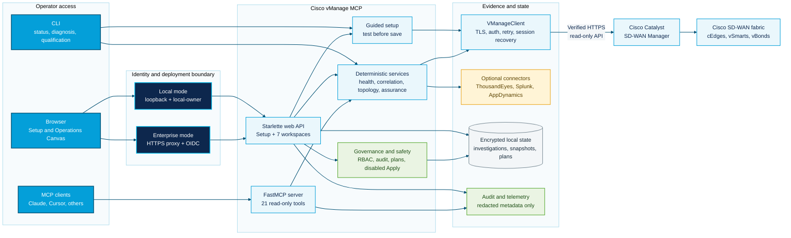

# Cisco vManage MCP Server


A production-grade [Model Context Protocol](https://modelcontextprotocol.io/) server for Cisco SD-WAN vManage. It exposes 21 read-only tools (16 retrieval, 4 diagnostic, 1 version) that let LLM agents query device status, tunnel health, alarms, policies, and deterministic incident analysis through natural language. A built-in **correlation engine** computes health signals, root-cause hypotheses, and blast-radius assessments in Python so the LLM explains structured results instead of improvising from raw API payloads. The package also provides a Click CLI, an interactive console with optional AI providers, a local browser operations canvas with connected topology and prioritized actions, and an MCP-client installer.

Launch the local browser workspace with `vmanage-web`, then open `http://127.0.0.1:8765`. Local mode enforces loopback at both startup and request time. Enterprise mode supports a single customer tenant behind an identity-aware HTTPS proxy and independently validates OIDC bearer tokens, trusted proxy addresses, public hosts, tenant claims, and application roles. See [Enterprise Deployment](docs/ENTERPRISE_DEPLOYMENT.md).

The current hardware-management scope is Cisco Catalyst SD-WAN through vManage. The roadmap defines separate adapters for other Cisco platforms; their APIs and semantics are not represented as supported today.

## Architecture



The blue path is the required Cisco SD-WAN evidence flow. Amber components are optional integrations; green and navy controls preserve read-only operation, identity, and auditability. See the [Guided Setup Guide](docs/SETUP_GUIDE.md) for the onboarding sequence and [Enterprise Deployment](docs/ENTERPRISE_DEPLOYMENT.md) for the production trust boundary.

### Design Principles

1. **APIs gather facts, Python computes signals, LLM explains results** -- the model never sees raw blobs and improvises conclusions
2. **Every conclusion is cited** -- each health signal references the specific API endpoint it came from
3. **Partial results over no results** -- if one endpoint fails, the response says which conclusions may be incomplete
4. **Read-only by design** -- all 21 public tools use GET requests; the only POST is session authentication
5. **Audit every tool** -- every tool and vManage API call can be recorded without logging response content

### Project Structure

```
src/cisco_vmanage_mcp/
├── server.py              # MCP server, tool registration
├── webapp.py              # Local browser Operations Canvas and evidence assistant
├── web_assets/            # Packaged HTML, CSS, and JavaScript
├── client.py              # Async HTTP client with retry/backoff
├── services/
│   ├── health_check.py    # Computed health signals from raw data
│   ├── correlation.py     # Root-cause analysis, blast radius
│   ├── connected_context.py # Topology normalization and action grouping
│   ├── investigations.py  # Encrypted, bounded browser investigation store
│   ├── persistence.py     # Shared owner-only encryption and SQLite primitives
│   ├── snapshots.py       # Historical snapshots, diffs, and SLA trends
│   ├── observability.py   # Optional privacy-bounded OTLP metrics
│   ├── connectors.py      # Isolated MCP/HTTPS evidence connectors
│   ├── qualification.py   # Sanitized environment capability assessment
│   ├── setup.py           # Test-before-save guided local setup
│   ├── workflows.py       # Encrypted preview-only workflow drafts
│   ├── browser_ai.py      # Optional sanitized provider explanations
│   ├── governance.py      # Local identity, RBAC, timelines, and agent policy
│   ├── deployment.py      # Validated local and enterprise deployment settings
│   ├── identity.py        # OIDC JWT verification and role/tenant mapping
│   ├── web_security.py    # Request identity, host, proxy, and browser controls
│   ├── change_plans.py    # Immutable plans, approval, and verification
│   └── audit.py           # Structured audit logging
├── tools/
│   ├── device_tools.py    # 4 tools: list, status, counters, interfaces
│   ├── tunnel_tools.py    # 3 tools: tunnels, BFD, OMP
│   ├── alarm_tools.py     # 3 tools: alarms, counts, events
│   ├── health_tools.py    # 3 tools: system status, control, fabric summary
│   ├── policy_tools.py    # 2 tools: policies, templates
│   ├── config_tools.py    # 1 tool: running config
│   ├── diagnostic_tools.py # 4 tools: correlation, diagnosis, pre-change, incident
│   └── version_tools.py   # 1 tool: installed/latest version
├── models/                # Pydantic compatibility models
└── utils/
    ├── errors.py          # Exception taxonomy mapping
    └── formatters.py      # Markdown/JSON response formatters
tests/                     # Unit, contract, security, and protocol tests
```

## Quick Start

```bash
# Clone the repository
git clone https://wwwin-github.cisco.com/jamiblai/sdwan-mcp-server.git
cd cisco-vmanage-mcp

# Create virtual environment and install
python3 -m venv .venv
source .venv/bin/activate  # macOS/Linux
python -m pip install -e '.[dev]'

# Configure credentials and detected MCP clients securely
vmanage-mcp-install

# Or launch the browser and follow the guided Setup workspace
vmanage-web

# Test with MCP Inspector
npx @modelcontextprotocol/inspector python -m cisco_vmanage_mcp

# Qualify a customer vManage environment without printing device identities
vmanage-mcp --json qualify > qualification-report.json
```

## Available Tools

### Retrieval Tools (16)

| Tool | Description | Endpoint |
|------|-------------|----------|
| `vmanage_list_devices` | List all devices in the SD-WAN fabric with status and filters | `GET /dataservice/device` |
| `vmanage_get_device_status` | Get detailed status for a specific device by system IP | `GET /dataservice/device` |
| `vmanage_get_device_counters` | Get interface error counters and drop stats | `GET /dataservice/device/counters` |
| `vmanage_get_device_interfaces` | Get interface list with status, IP, speed, TX/RX | `GET /dataservice/device/interface` |
| `vmanage_list_tunnels` | List IPsec tunnels with jitter, latency, loss | `GET /dataservice/device/tunnel` |
| `vmanage_get_bfd_sessions` | Get BFD session status (underlay health checks) | `GET /dataservice/device/bfd/sessions` |
| `vmanage_get_omp_peers` | Get OMP peer list (overlay control plane) | `GET /dataservice/device/omp/peers` |
| `vmanage_list_alarms` | List active alarms with severity and time filters | `GET /dataservice/alarms` |
| `vmanage_get_alarm_count` | Get alarm count by severity for quick health checks | `GET /dataservice/alarms/count` |
| `vmanage_list_events` | List recent system events with server-side time/device filters | `GET /dataservice/event` |
| `vmanage_list_policies` | List vSmart policies with activation status | `GET /dataservice/template/policy/vsmart` |
| `vmanage_list_templates` | List device templates with attached device counts | `GET /dataservice/template/device` |
| `vmanage_get_running_config` | Get running configuration for a device (by UUID) | `GET /dataservice/template/config/running/{uuid}` |
| `vmanage_get_system_status` | Get CPU, memory, disk usage for a device | `GET /dataservice/device/system/status` |
| `vmanage_get_control_status` | Get control connections (vSmart/vBond connectivity) | `GET /dataservice/device/control/connections` |
| `vmanage_get_fabric_summary` | Get overall fabric health summary (composite tool) | Multiple endpoints |

### Diagnostic Tools (4) -- Correlation and Root-Cause Analysis

| Tool | Description | What It Does |
|------|-------------|--------------|
| `vmanage_assess_fabric_health` | Correlated fabric health assessment | Computes per-device health signals, correlates failures across sites, estimates blast radius, generates ranked root-cause hypotheses. Every conclusion cites its API source. |
| `vmanage_diagnose_device` | Deep single-device diagnosis with fabric context | Fetches device-specific and fabric-wide data concurrently. Determines if the device issue is isolated or part of a wider failure. |
| `vmanage_pre_change_validation` | Pre-change go/no-go check | Validates fabric health before config changes. Returns blockers (critical alarms, controller down) and warnings (edge issues). |
| `vmanage_incident_summary` | Audience-aware incident summary | Generates executive (3-5 lines) or engineer (full detail) summaries with impact assessment and next steps. |

### Version Tool (1)

| Tool | Description |
|------|-------------|
| `vmanage_check_version` | Compare the installed package version with repository tags over verified HTTPS |

## Engineering Capabilities

### Correlation and Root-Cause Analysis

The diagnostic tools don't just retrieve data -- they reason over network state:

- **Correlate** unreachable edges with missing control connections and BFD sessions
- **Map** BFD failures to likely transport issues
- **Identify** isolated device failures vs site-level vs fabric-wide outages
- **Estimate** blast radius by site and device count
- **Generate** ranked root-cause hypotheses with confidence levels

Example output from `vmanage_assess_fabric_health`:

```
## Fabric Health: CRITICAL

### Devices
- Controllers: 3 (3 reachable)
- WAN Edges: 4 (3 reachable, 1 unreachable)

### Impact Assessment
- Scope: **site**
- All devices at site 100 are unreachable. Impact is isolated to this site.
  Other sites maintain connectivity.

### Root-Cause Hypotheses
**1. Site 100 WAN outage (all 1 device(s) unreachable)** (confidence: high)
   - All devices at site 100 are unreachable simultaneously
   - Other sites maintain connectivity
   - Suggested checks: Check WAN circuit(s) at site 100; Verify upstream router/switch

### Data Sources
- GET /dataservice/device: OK (234ms)
- GET /dataservice/alarms/count: OK (156ms)
```

### Failure Handling

- **Retry with exponential backoff** for transient failures (429, 500-504)
- **Per-request timeout tracking** with duration logging
- **Partial-result reporting** -- if one endpoint fails, the rest still return
- **Explicit uncertainty** -- responses state which conclusions may be incomplete
- **Exception taxonomy** -- `RateLimitError`, `NotFoundError`, `PermissionError`, `TimeoutError`, `ConnectionError` (all subclass `VManageError`)

Example partial result:

```
**Note:** This assessment is partial. Data from GET /dataservice/alarms/count
could not be retrieved, so alarm-related conclusions may be incomplete.
```

### Operational Guardrails

- **Read-only by design** -- all 21 public tools use GET/get-raw client methods
- **Audit logging** -- every tool call records timestamp, name, redacted parameters, result type/length, and duration
- **Safe tool descriptions** -- each tool clearly states what it does, what parameters it needs, and what the model should NOT assume
- **MCP annotations** -- `readOnlyHint: true`, `destructiveHint: false` on every tool

Set `AUDIT_LOG_PATH` to enable file-based audit logging:

```bash
export AUDIT_LOG_PATH=/var/log/vmanage-mcp/audit.jsonl
```

### Customer Environment Qualification

Run `vmanage-mcp qualify` before accepting a customer environment. The command performs bounded, read-only probes for inventory, alarms, templates, policies, interfaces, counters, BFD, control, OMP, tunnel statistics, application-route statistics, and system status. Its versioned report includes only manager address, aggregate device types/models/software versions, endpoint status, row counts, latency, and sanitized failure categories. It does not export hostnames, system IPs, configuration, credentials, or response bodies.

Required inventory and alarm capabilities determine readiness. Optional endpoint failures are reported as `forbidden`, `unsupported`, or `unavailable` without hiding the capabilities that succeeded. Preserve the JSON report as evidence for the customer's exact software and permission baseline.

### Operator Workflows

| Workflow | Tool | Use Case |
|----------|------|----------|
| Pre-change validation | `vmanage_pre_change_validation` | "Is the fabric healthy enough to push policy?" |
| Incident triage | `vmanage_assess_fabric_health` | "Which sites are affected? Is this transport-specific?" |
| Device diagnosis | `vmanage_diagnose_device` | "What's wrong with this specific device?" |
| Executive briefing | `vmanage_incident_summary` (audience=executive) | "5-line summary for leadership" |
| Engineer deep-dive | `vmanage_incident_summary` (audience=engineer) | "Exact failing devices, sessions, transports, alarms" |

### Testing

The suite includes service unit tests plus client, credential, identity, deployment, audit, telemetry, packaging-contract, entry-point, and all-tool JSON/Markdown tests. Core branch coverage is gated at 60%; the CLI, installer, interactive console, and AI-provider adapters also have separate 60% module gates.

Run tests:

```bash
python -m pip install -e '.[dev]'
make check
make security
make build
```

## Configuration

| Variable | Description | Default |
|----------|-------------|---------|
| `VMANAGE_HOST` | vManage hostname or IP | `sandbox-sdwan-2.cisco.com` |
| `VMANAGE_PORT` | vManage HTTPS port | `443` |
| `VMANAGE_USERNAME` | vManage username | *(required)* |
| `VMANAGE_PASSWORD` | vManage password | *(required)* |
| `VMANAGE_VERIFY_SSL` | Verify TLS certificates (`true` or `false`) | `true` |
| `VMANAGE_CA_BUNDLE` | Private CA bundle used with verification enabled | *(system trust)* |
| `VMANAGE_CONFIG_FILE` | Protected dotenv file written by the installer | `~/.vmanage-mcp/vmanage.env` |
| `VMANAGE_MAX_RETRIES` | Transient retries, from 0 through 10 | `3` |
| `AUDIT_LOG_PATH` | Path for audit log file (JSONL format) | *(disabled)* |
| `AUDIT_STDERR` | Also write structured audit events to stderr | `false` |
| `VMANAGE_WEB_HOST` | Browser workspace bind address (loopback only) | `127.0.0.1` |
| `VMANAGE_WEB_PORT` | Browser workspace port | `8765` |
| `VMANAGE_WEB_STATE_DIR` | Owner-only encrypted browser investigation state | `~/.vmanage-mcp/browser` |
| `VMANAGE_WEB_AUTH_MODE` | Browser identity mode: `local` or `oidc` | `local` |
| `VMANAGE_WEB_PUBLIC_URL` | Credential-free HTTPS origin required in OIDC mode | *(required for OIDC)* |
| `VMANAGE_WEB_ALLOWED_HOSTS` | Comma-separated public host allowlist | *(required for OIDC)* |
| `VMANAGE_WEB_TRUSTED_PROXY_IPS` | Immediate proxy IPs/CIDRs trusted for forwarded HTTPS | `127.0.0.1,::1` |
| `VMANAGE_WEB_OIDC_ISSUER` | Exact HTTPS token issuer | *(required for OIDC)* |
| `VMANAGE_WEB_OIDC_AUDIENCE` | Required token audience | *(required for OIDC)* |
| `VMANAGE_WEB_OIDC_JWKS_URL` | HTTPS signing-key endpoint | *(required for OIDC)* |
| `VMANAGE_WEB_OIDC_JWKS_RETRY_SECONDS` | Backoff after a failed signing-key refresh, clamped to 1-300 seconds | `30` |
| `VMANAGE_WEB_TENANT_ID` | Exact customer tenant claim accepted by this instance | *(required for OIDC)* |
| `VMANAGE_WEB_OIDC_OWNER_ROLES` | Comma-separated IdP roles mapped to owner | `vmanage-owner` |
| `VMANAGE_WEB_OIDC_OPERATOR_ROLES` | Comma-separated IdP roles mapped to operator | `vmanage-operator` |
| `VMANAGE_WEB_OIDC_VIEWER_ROLES` | Comma-separated IdP roles mapped to viewer | `vmanage-viewer` |
| `VMANAGE_WEB_OIDC_TOKEN_USE_CLAIM` | Optional claim distinguishing access tokens | *(disabled)* |
| `VMANAGE_WEB_OIDC_REQUIRED_TOKEN_USE` | Required value for the token-use claim | *(disabled)* |
| `VMANAGE_WEB_OIDC_CA_BUNDLE` | Private CA bundle for the OIDC JWKS endpoint | *(system trust)* |
| `VMANAGE_SOURCE_STALE_SECONDS` | Snapshot source delay threshold, clamped to 1-86400 seconds | `300` |
| `VMANAGE_OTEL_ENABLED` | Export snapshot metrics through OTLP | `false` |
| `VMANAGE_OTEL_TIMEOUT_MS` | OTLP force-flush timeout, clamped to 100-30000 ms | `5000` |
| `OTEL_EXPORTER_OTLP_ENDPOINT` | Standard OTLP HTTP collector endpoint | *(SDK default)* |
| `BROWSER_AI_PROVIDER` | Browser explainer: `claude`, `openai`, or `gemini` | *(disabled)* |
| `BROWSER_AI_MODEL` | Optional browser explainer model override | *(provider default)* |
| `THOUSANDEYES_MCP_URL` | ThousandEyes Streamable HTTP MCP endpoint (HTTPS only) | *(disabled)* |
| `THOUSANDEYES_MCP_TOKEN` | ThousandEyes MCP bearer token | *(required when enabled)* |
| `THOUSANDEYES_MCP_TIMEOUT_MS` | Per-collection timeout, clamped to 1000-120000 ms | `30000` |
| `THOUSANDEYES_HANDOFF_URL` | Optional credential-free HTTPS specialist view | *(disabled)* |
| `CONNECTOR_CA_BUNDLE` | Private CA bundle for HTTPS evidence connectors | *(system trust)* |
| `SPLUNK_EVIDENCE_URL` | HTTPS JSON evidence feed | *(disabled)* |
| `SPLUNK_EVIDENCE_TOKEN` | Server-side evidence-feed token | *(required when enabled)* |
| `SPLUNK_HANDOFF_URL` | Optional credential-free HTTPS specialist view | *(disabled)* |
| `APPDYNAMICS_EVIDENCE_URL` | HTTPS JSON evidence feed | *(disabled)* |
| `APPDYNAMICS_EVIDENCE_TOKEN` | Server-side evidence-feed token | *(required when enabled)* |
| `APPDYNAMICS_HANDOFF_URL` | Optional credential-free HTTPS specialist view | *(disabled)* |
| `VMANAGE_MCP_TELEMETRY` | Enable minimal Splunk telemetry | `false` |
| `VMANAGE_MCP_IDE_TELEMETRY` | Enable Cisco IDE SDK telemetry | `false` |
| `AI_CA_BUNDLE` | AI-provider CA path, or `bundled` for packaged Cisco roots | *(system trust)* |

## Compatibility

| Requirement | Details |
|-------------|----------|
| **Cisco platform** | Cisco Catalyst SD-WAN managed by vManage; other Cisco product families require future adapters |
| **vManage versions** | Live-qualified against vManage 20.18.2.1 with cEdge 17.18.01a on September 8, 2026; historical fixtures cover 20.10.1. Other releases require `vmanage-mcp qualify` until the broader capability matrix is complete |
| **vManage user role** | `operator` or above (read-only tools require read access only) |
| **MCP clients** | Claude Desktop, Claude Code, Cursor, or any MCP-compatible client |
| **Python** | 3.11 or newer |

## Usage with Claude Desktop

### macOS

Add to `~/Library/Application Support/Claude/claude_desktop_config.json`:

```json
{
  "mcpServers": {
    "cisco-vmanage": {
      "command": "python",
      "args": ["-m", "cisco_vmanage_mcp"],
      "cwd": "/path/to/cisco-vmanage-mcp",
      "env": {
        "VMANAGE_CONFIG_FILE": "/Users/you/.vmanage-mcp/vmanage.env"
      }
    }
  }
}
```

### Windows

Add to `%APPDATA%\Claude\claude_desktop_config.json`:

```json
{
  "mcpServers": {
    "cisco-vmanage": {
      "command": "python",
      "args": ["-m", "cisco_vmanage_mcp"],
      "cwd": "C:\\path\\to\\cisco-vmanage-mcp",
      "env": {
        "VMANAGE_CONFIG_FILE": "C:\\Users\\you\\.vmanage-mcp\\vmanage.env"
      }
    }
  }
}
```

## Usage with Claude Code (Recommended)

Use the installer so the password is not exposed in process arguments:

```bash
vmanage-mcp-install
```

Then start a session and ask questions in plain English:

```bash
claude
> How's the SD-WAN fabric looking?
> Are there any critical alarms?
> Show me BFD sessions for the site 200 router
```

## Usage with VS Code (Cisco IDE)

This server is available on the [Cisco IDE MCP Marketplace](https://ide.cisco.com/mcp/). You can install it directly from VS Code:

1. Open VS Code (Cisco IDE)
2. Go to **MCP Servers** in the marketplace
3. Search for "Cisco vManage"
4. Click **Install** and configure your environment variables

Or add it manually to your VS Code `settings.json`:

```json
{
  "mcp": {
    "servers": {
      "cisco-vmanage": {
        "command": "python",
        "args": ["-m", "cisco_vmanage_mcp"],
        "type": "stdio",
        "env": {
          "VMANAGE_CONFIG_FILE": "/Users/you/.vmanage-mcp/vmanage.env"
        }
      }
    }
  }
}
```

## Example Conversations

**"How's the SD-WAN fabric looking?"**
→ Agent calls `vmanage_assess_fabric_health` for correlated health assessment with root-cause analysis, impact scope, and data source citations.

**"Is it safe to push a policy change right now?"**
→ Agent calls `vmanage_pre_change_validation` for a go/no-go recommendation with blockers and warnings.

**"What's wrong with dc-cedge01?"**
→ Agent calls `vmanage_diagnose_device` with `system_ip=10.10.1.11` for deep diagnosis with fabric context (is this isolated or part of a wider failure?).

**"Give me a summary for our NOC manager"**
→ Agent calls `vmanage_incident_summary` with `audience=executive` for a 3-5 line executive briefing.

**"Show me the full incident details for the engineering team"**
→ Agent calls `vmanage_incident_summary` with `audience=engineer` for detailed analysis with device names, sessions, root causes, and next steps.

**"Are there any unreachable devices?"**
→ Agent calls `vmanage_list_devices` with `reachability=unreachable` to find devices that are offline.

**"Show me tunnel health for the site2 router"**
→ Agent calls `vmanage_list_tunnels` with `system_ip=10.10.1.15` to get IPsec tunnel stats including jitter, latency, and loss.

## Development

### Validation Models

FastMCP tools intentionally use flat parameters so generated MCP schemas stay simple. External Python callers that want local validation can import the equivalent helpers from `cisco_vmanage_mcp.models`; these models are optional helpers and are not required to call the tools.

### Running Tests

```bash
python -m pip install -e '.[dev]'
make check
make security
make build
```

### Adding a New Tool

1. Add a formatter function in `utils/formatters.py`
2. Register the tool in the appropriate `tools/` file using `@mcp.tool()` with flat parameters (not Pydantic models)
3. Add `@audit_tool("tool_name")` decorator for audit logging
4. For diagnostic tools, add computation logic in `services/` and keep the tool thin
5. Add unit tests with mocked API responses in `tests/`
6. The tool is automatically available after server restart

### Testing with MCP Inspector

```bash
npx @modelcontextprotocol/inspector python -m cisco_vmanage_mcp
```

### Guided Browser Setup

Open `http://127.0.0.1:8765/#setup`. When credentials are missing or invalid, the browser opens Setup automatically.

1. Confirm the deployment mode and private configuration location.
2. Enter a dedicated read-only vManage account and keep TLS verification enabled.
3. Select **Test connection** to authenticate and run all read-only capability checks.
4. Review the full qualification table, then select **Save and connect**.
5. Download the sanitized JSON report for the customer onboarding record.
6. Run the displayed `vmanage-mcp-install` command on operator workstations that need MCP client access.

Passwords are sent only to the local server for validation, stored in the owner-only configuration file, and never returned by the API. Existing connections can be qualified without re-entering credentials. In enterprise OIDC mode the screen is status-only; secrets remain controlled by the deployment platform.

The field-by-field walkthrough, expected outputs, failure recovery, and Cisco-colored setup flow are in the [Guided Setup Guide](docs/SETUP_GUIDE.md).

For a sanitized live pass/fail check of all 21 tools against the configured environment:

```bash
python scripts/live_readonly_audit.py
```

The harness discovers identifiers dynamically and does not print or persist tool response content.

### DevNet Sandbox

This project is tested against the [Cisco DevNet always-on SD-WAN sandbox](https://devnetsandbox.cisco.com/DevNet/catalog/sd-wan-20-10). On September 8, 2026, `vmanage-mcp qualify` reported vManage 20.18.2.1, cEdge 17.18.01a, 7 devices, and all 12 read-only capability probes available. The user role is `operator` (read-only), which matches this server's read-only tools.

## Licence

[Apache 2.0](LICENSE), matching the DefenseClaw ecosystem licence for potential upstream contribution.

## Safety

All 21 public tools are **read-only** and carry `readOnlyHint: true` and `destructiveHint: false`. The public client exposes GET and get-raw operations only. Authentication still requires `POST /j_security_check`; there are no configuration-changing POST, PUT, PATCH, or DELETE tool paths. Pre-change validation fails closed with `NO-GO` when required evidence is unavailable or the device inventory is empty.

## Telemetry

Telemetry is disabled by default. There are two independent integrations with different destinations and payloads.

### Minimal Splunk telemetry

| Field | Example | Purpose |
|-------|---------|---------|
| Tool name | `vmanage_list_devices` | Know which tools are used |
| Random installation ID | `a1b2c3d4...` | Count installations without hashing usernames |
| Duration (ms) | `234` | Track performance |
| Success/failure | `true` | Track reliability |
| Server version | `1.1.0` | Track deployment versions |
| Timestamp | `2026-09-07T12:00:00Z` | Usage patterns over time |

This path does not include credentials, device identifiers, alarms, API bodies, or running configuration. Enable it with:

```bash
export VMANAGE_MCP_TELEMETRY=true
export SPLUNK_HEC_URL=https://your-splunk-instance:8088/services/collector
export SPLUNK_HEC_TOKEN=your-hec-token
```

### Cisco IDE telemetry

The optional Cisco SDK integration is installed with `python -m pip install -e '.[marketplace]'` on Python 3.12 or newer. The upstream SDK automatically collects system hostname, IP address, and MAC address in addition to the tool name, duration, result, package version, and marketplace metadata. Review Cisco data-handling requirements before opting in:

```bash
export VMANAGE_MCP_IDE_TELEMETRY=true
export IDE_MCP_MARKETPLACE_ID=your-marketplace-id
```

Both telemetry paths are best-effort and never alter tool results.

### OpenTelemetry assurance metrics

Install `python -m pip install -e '.[observability]'` and set `VMANAGE_OTEL_ENABLED=true` to export snapshot-derived device reachability, alarm, BFD, control, and SLA metrics through the standard OTLP HTTP exporter. Labels include operational dimensions such as site, device type, fault domain, and impact scope; they exclude hostnames, system IPs, alarm text, and configuration content. Export failure never blocks snapshot capture.

## AI Providers and Data Egress

`vmanage-console` can use Anthropic, OpenAI, or Google when the corresponding optional extra is installed. Prompts and selected tool results are sent to the chosen provider. Do not enable a provider for production network data without organizational approval. API keys entered interactively are hidden and, when explicitly saved, use the OS keyring rather than JSON. Provider tool-call loops are capped at ten rounds.

The browser remains deterministic by default. Set `BROWSER_AI_PROVIDER` and install the matching AI extra to enable the **AI explain** mode. Only the operator question and a redacted, size-bounded normalized evidence result are sent; the deterministic answer remains visible. Provider keys stay in environment variables or the OS keyring and are never returned to browser JavaScript.

## Connectors and Workflow Drafts

The Integrations workspace shows all connector states, including unconfigured adapters. ThousandEyes uses an explicitly configured HTTPS MCP endpoint; Splunk and AppDynamics use explicitly configured HTTPS JSON evidence feeds. Collection is user-triggered, bounded, source-cited, and isolated from core diagnosis. Review connector-specific data handling before enabling external egress.

ServiceNow, Webex, and Slack integration currently stops at encrypted local previews. Drafts expire, are idempotent, and require approval bound to the exact content hash. There is no delivery method or `/send` endpoint in v1.5.0.

## Identity, Collaboration, and Governance

The default loopback browser uses a fixed `local-owner` identity. Enterprise mode accepts only cryptographically verified OIDC bearer tokens forwarded by an identity-aware proxy, pins every token to one configured customer tenant, and maps configurable IdP roles to owner, operator, or viewer. Viewer identities are read-only at the HTTP boundary. Investigations gain an encrypted ownership record, revisioned comment timeline, stale-evidence flags, and deterministic Executive, NOC, NetOps, and SecOps projections.

Enterprise mode is designed for one customer tenant per deployment. It requires TLS termination, a private application service, an approved identity-aware proxy, and customer validation of issuer, audience, claims, roles, CA chains, retention, and audit handling. The application does not issue browser cookies; introducing cookie authentication requires a separate CSRF-token design and review.

## Guarded Change Planning

The Changes workspace creates immutable planning artifacts for device-template attachment or central-policy activation intent. Each plan binds an intent, exact target set, canary subset, pre-change snapshot, expiry, rollback strategy, and SHA-256 content hash. A local human owner can approve that exact hash for a short window and compare a later snapshot to produce rollback decision support.

This package does not execute changes. The plan store has no apply method, the browser Apply control is disabled, and the Apply API always returns HTTP 403. See [docs/THREAT_MODEL.md](docs/THREAT_MODEL.md) for the independent gates required before a separate write-capable deployment could be considered.

## Security

- **Credential handling:** `vmanage-mcp-install` writes vManage settings to `~/.vmanage-mcp/vmanage.env` with mode `0600` in a `0700` directory. Generated MCP configuration and Claude CLI arguments contain only that file path.
- **Audit log protection:** Secret-like fields are redacted, result content is never logged, files rotate, and audit files are mode `0600`. Set `AUDIT_STDERR=true` only when stderr records are wanted.
- **Session lifecycle:** Session cookies and XSRF tokens remain in memory and are refreshed with a compare-and-swap lock.
- **Browser identity:** Enterprise requests require a signed OIDC bearer token with pinned issuer, audience, tenant, lifetime, asymmetric algorithm, and application role. Unknown signing keys are refresh-throttled.
- **Network boundary:** Local requests must originate from loopback. Enterprise requests require an allowed host and direct HTTPS or a trusted proxy peer asserting HTTPS.
- **XSRF token lifecycle:** A fresh XSRF token is obtained on each authentication. Tokens are refreshed automatically on `403` responses using compare-and-swap to avoid races under concurrent tool calls.
- **TLS verification:** Verification defaults to `true`; invalid boolean values are rejected. Use `VMANAGE_CA_BUNDLE` for private roots. `false` is an explicit isolated-lab exception.
- **Enterprise interception roots:** The packaged Cisco bundle is used by AI providers only when `AI_CA_BUNDLE=bundled` is explicitly set.
- **Browser state:** Investigations and snapshots use encrypted payloads in owner-only local files. Optional configuration comparison retains SHA-256 digests only.
- **Dependency policy:** CI runs Bandit and audits the declared runtime dependency resolution for known vulnerabilities.

## Demo Output

Asking Claude Code: *"I need to push a policy update in the next 30 minutes. Assess fabric health and give me an executive summary and an engineer breakdown."*

Claude calls `vmanage_assess_fabric_health`, `vmanage_incident_summary` (executive), `vmanage_incident_summary` (engineer), and `vmanage_list_alarms` **in parallel**, then synthesises the results:

```
Recommendation: DO NOT PUSH - Fabric is in CRITICAL state

One device is completely unreachable and 28 alarms are active (9 Critical).
Pushing a policy now would result in inconsistent policy state and risks
compounding the active incident.
```

**Executive summary** (ready to send to leadership):

> The SD-WAN fabric is currently in a CRITICAL health state. One WAN edge
> device (dc-cedge01 at Site 100) is completely offline with no control
> plane or data plane connectivity. The impact is contained to Site 100;
> all other sites and controllers are operational. A policy update is not
> recommended at this time.

**Engineer breakdown** (abbreviated):

```
Fabric Health: CRITICAL | Data Completeness: Full

Controllers: 3 (3 reachable) | WAN Edges: 4 (3 reachable, 1 unreachable)
BFD Sessions: 24 active | Alarms: 28 (9 Critical, 13 Major)

Affected device: dc-cedge01 (10.10.1.11, vedge-C8000V)
  BFD sessions: 0 | Control connections: 0 | Site: 100

Root cause (high confidence): WAN circuit failure at Site 100
  - Simultaneous control + data plane loss from a single site
  - All other sites healthy → transport failure, not device crash

Blast radius: Site-isolated, no impact to other sites
```

*Tested live against the Cisco DevNet always-on SD-WAN sandbox, most recently vManage 20.18.2.1 with cEdge 17.18.01a, with bounded concurrent read-only calls.*

Asking Claude: *"Is it safe to push a config change right now?"*

```
## Pre-Change Validation: **PROCEED WITH CAUTION**

**Recommendation:** Non-critical issues detected. Changes may be safe
but require awareness.

### Warnings (proceed with awareness)
- [~] 1 WAN edge(s) unreachable: dc-cedge01

### Fabric Status
- Controllers: 3/3 reachable
- WAN Edges: 3/4 reachable

### Data Sources
- GET /dataservice/device: OK
- GET /dataservice/alarms/count: OK
```

## Acknowledgements

- [Cisco DevNet](https://developer.cisco.com/) for the always-on SD-WAN sandbox
- [Anthropic MCP SDK](https://github.com/anthropics/python-sdk) (FastMCP framework)

## Contributing

This is an internal Cisco project hosted on **wwwin-github**.

- **Issues:** File issues on the [wwwin-github repository](https://wwwin-github.cisco.com/jamiblai/sdwan-mcp-server/issues). Include the tool name, vManage version, and a sanitised error message.
- **Branch naming:** Use `feature/<short-description>` for new features and `fix/<short-description>` for bug fixes.
- **Pull requests:** PRs must include unit tests for any new or modified tools. Run `pytest -v` locally before submitting and make sure all tests pass.
- **Code style:** Follow the existing patterns: flat tool parameters (no Pydantic models in tool signatures), `@audit_tool` decorator on every tool, and formatters in `utils/formatters.py`.

## Roadmap

The research-backed roadmap is maintained in [docs/ROADMAP.md](docs/ROADMAP.md). It incorporates current Cisco direction around AgenticOps, AI Canvas, Cloud Control, AI Assistant, ThousandEyes assurance and MCP workflows, while distinguishing available features from beta, preview, and announced capabilities.

The roadmap now covers enterprise deployment, repeatable customer qualification, multi-fabric operations, product-specific Cisco adapters, resilient shared infrastructure, and a separately governed execution plane. Current implementation reaches the v2.1 engineering foundation; customer IdP qualification, load, accessibility, restore, privacy, and penetration-test acceptance remain deployment gates. Live write operations remain unavailable.
