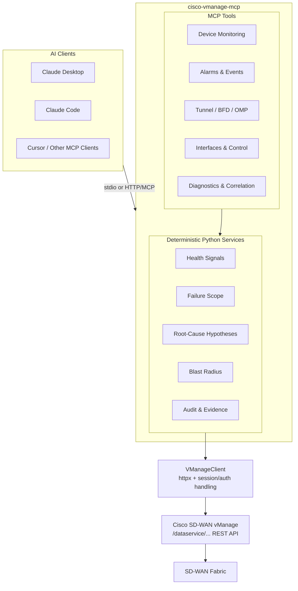

# Cisco vManage MCP Server


A read-only [Model Context Protocol](https://modelcontextprotocol.io/) server for Cisco SD-WAN vManage that lets AI clients query fabric health, devices, tunnels, BFD sessions, OMP peers, alarms, policies and configuration state through natural language.

The project is deliberately built around a simple boundary:

> **APIs gather facts. Python computes signals. The LLM explains the evidence.**

Rather than asking a model to improvise network conclusions from raw API payloads, the server exposes structured tools and a deterministic correlation layer. The Python services compute health signals, failure scope, blast radius and ranked root-cause hypotheses; the AI client is then used to select tools, explain the resulting evidence and adapt the level of detail to the operator.

**20 read-only tools:** 16 retrieval tools and 4 diagnostic workflows.

> **Independent project. Not an official Cisco product or Cisco-supported integration.**

## Why I built it

SD-WAN troubleshooting often means moving between device state, control connections, BFD sessions, alarms, tunnel performance and policy information before a useful picture emerges.

This project explores how AI can make that operational data easier to query without making the language model the source of truth. It provides natural-language access to vManage telemetry while keeping network reasoning, safety controls and evidence provenance in normal application code.

Typical questions include:

- "How is the SD-WAN fabric looking?"
- "Which sites are affected by this incident?"
- "Is this device failure isolated or part of a wider problem?"
- "Is the fabric healthy enough for a planned change?"
- "Give me a short incident summary for leadership and the technical detail for engineering."

## AI design

AI is used in two distinct ways in this project.

### Runtime AI

MCP clients such as Claude can select and call the server's tools using natural language. The model receives structured results rather than unrestricted access to vManage and is not responsible for calculating the underlying network health signals.

The runtime design follows five principles:

1. **APIs gather facts, Python computes signals, LLM explains results.**
2. **Conclusions carry evidence.** Health and diagnostic signals reference the vManage API data used to derive them.
3. **Partial results are explicit.** If one source fails, the response identifies what is missing rather than presenting an incomplete assessment as complete.
4. **Read-only by design.** The current tool surface uses GET operations only.
5. **Audit everything.** Tool calls and API activity can be recorded with sensitive values redacted.

### AI-assisted development

AI-assisted development was used to accelerate prototyping, implementation, test generation and iteration. Architecture, vManage API behaviour, networking logic, correlation rules, security boundaries and technical outputs were independently validated through unit tests, mocked API responses and testing against the Cisco DevNet SD-WAN sandbox.

The aim was to use AI to increase engineering velocity while retaining explicit control over the parts of the system where correctness, networking semantics and operational safety matter.

## Architecture



## Available tools

### Retrieval tools (16)

| Tool | Purpose | vManage data |
|---|---|---|
| `vmanage_list_devices` | List fabric devices with status and filters | `/dataservice/device` |
| `vmanage_get_device_status` | Detailed status for one device | `/dataservice/device` |
| `vmanage_get_device_counters` | Interface errors and drop counters | `/dataservice/device/counters` |
| `vmanage_get_device_interfaces` | Interfaces, state, addressing and traffic | `/dataservice/device/interface` |
| `vmanage_list_tunnels` | IPsec tunnel health, jitter, latency and loss | `/dataservice/device/tunnel` |
| `vmanage_get_bfd_sessions` | BFD session state | `/dataservice/device/bfd/sessions` |
| `vmanage_get_omp_peers` | OMP peer state | `/dataservice/device/omp/peers` |
| `vmanage_list_alarms` | Active alarms with severity/time filters | `/dataservice/alarms` |
| `vmanage_get_alarm_count` | Alarm counts by severity | `/dataservice/alarms/count` |
| `vmanage_list_events` | Recent system events | `/dataservice/event` |
| `vmanage_list_policies` | vSmart policy state | `/dataservice/template/policy/vsmart` |
| `vmanage_list_templates` | Device templates and attachments | `/dataservice/template/device` |
| `vmanage_get_running_config` | Running configuration for a device | `/dataservice/template/config/running/{uuid}` |
| `vmanage_get_system_status` | CPU, memory and disk state | `/dataservice/device/system/status` |
| `vmanage_get_control_status` | vSmart/vBond control connections | `/dataservice/device/control/connections` |
| `vmanage_get_fabric_summary` | Composite fabric summary | Multiple endpoints |

### Diagnostic tools (4)

| Tool | Operational use |
|---|---|
| `vmanage_assess_fabric_health` | Correlates fabric state, classifies failure scope, estimates blast radius and ranks root-cause hypotheses with evidence |
| `vmanage_diagnose_device` | Deep single-device diagnosis with wider fabric context to distinguish isolated from broader faults |
| `vmanage_pre_change_validation` | Pre-change health check returning blockers and warnings before planned work |
| `vmanage_incident_summary` | Produces structured incident context for executive or engineering audiences |

## Correlation and diagnostics

The diagnostic layer combines multiple vManage observations before presenting an assessment. It can:

- correlate unreachable WAN edges with control-connection and BFD state
- map BFD failures to likely transport-related conditions
- distinguish device-level, site-level and fabric-wide failure patterns
- estimate blast radius by site and affected device count
- rank root-cause hypotheses with confidence and supporting observations
- identify when missing data makes an assessment incomplete

Example:

```text
Fabric Health: CRITICAL

Controllers: 3/3 reachable
WAN Edges: 3/4 reachable

Impact scope: site
Site 100 is affected while other sites remain reachable.

Hypothesis: site transport outage
Confidence: high
Evidence:
- edge unreachable
- no BFD sessions
- no control connections
- other sites healthy

Data sources:
- GET /dataservice/device: OK
- GET /dataservice/alarms/count: OK
```

A hypothesis is presented as a hypothesis. The server does not treat correlation as proof of physical root cause.

## Operational guardrails

The current server is intentionally read-only.

- all 20 MCP tools use read-only vManage API operations
- `readOnlyHint: true` and `destructiveHint: false` annotations are exposed to MCP clients
- credentials come from environment variables and are never returned in tool output
- audit logging redacts passwords and session tokens
- transient failures use retry with exponential backoff
- authentication refresh is concurrency-safe
- partial-result handling preserves useful evidence when one source is unavailable
- tool descriptions define what the model may and may not infer from a result

## Failure handling

The client distinguishes operational failures rather than collapsing them into generic errors:

- `RateLimitError`
- `NotFoundError`
- `PermissionError`
- `TimeoutError`
- `ConnectionError`

For transient HTTP failures such as 429 and 5xx responses, requests can be retried with exponential backoff. If one data source remains unavailable, diagnostic responses explicitly identify the missing source and which conclusions may therefore be incomplete.

## Project structure

```text
src/cisco_vmanage_mcp/
├── server.py               # MCP server and tool registration
├── client.py               # Async vManage client, auth, retry/backoff
├── services/
│   ├── health_check.py     # Deterministic health signals
│   ├── correlation.py      # Failure scope, hypotheses, blast radius
│   └── audit.py            # Structured audit logging
├── tools/
│   ├── device_tools.py
│   ├── tunnel_tools.py
│   ├── alarm_tools.py
│   ├── health_tools.py
│   ├── policy_tools.py
│   ├── config_tools.py
│   └── diagnostic_tools.py
├── models/                 # Pydantic validation
└── utils/
    ├── errors.py           # Exception taxonomy
    └── formatters.py       # Structured output formatters

tests/
└── test_health_and_correlation.py
```

## Quick start

Requires Python 3.11 or newer.

```bash
git clone https://github.com/weegienamja/sdwan-mcp-server.git
cd sdwan-mcp-server

python -m venv .venv
source .venv/bin/activate  # Windows: .venv\Scripts\activate
pip install -e ".[dev]"

cp .env.example .env
# Add your vManage connection details to .env

pytest -v
npx @modelcontextprotocol/inspector python -m cisco_vmanage_mcp
```

## Configuration

| Variable | Description | Default |
|---|---|---|
| `VMANAGE_HOST` | vManage hostname or IP | `sandbox-sdwan-2.cisco.com` |
| `VMANAGE_PORT` | vManage HTTPS port | `443` |
| `VMANAGE_USERNAME` | vManage username | required |
| `VMANAGE_PASSWORD` | vManage password | required |
| `VMANAGE_VERIFY_SSL` | Verify SSL certificates | `false` |
| `VMANAGE_MAX_RETRIES` | Maximum transient-failure retries | `3` |
| `AUDIT_LOG_PATH` | Optional JSONL audit log | disabled |

`VMANAGE_VERIFY_SSL=false` is intended for lab and DevNet sandbox use. Enable certificate verification for production environments.

## Use with Claude Code

```bash
cd sdwan-mcp-server

claude mcp add cisco-vmanage \
  -e VMANAGE_HOST=sandbox-sdwan-2.cisco.com \
  -e VMANAGE_PORT=443 \
  -e VMANAGE_USERNAME=your_username \
  -e VMANAGE_PASSWORD=your_password \
  -e VMANAGE_VERIFY_SSL=false \
  -- .venv/bin/python -m cisco_vmanage_mcp
```

Then query the fabric in natural language:

```text
How is the SD-WAN fabric looking?
Are there any critical alarms?
Which sites are affected?
Show BFD sessions for this edge.
Is the fabric healthy enough for a planned change?
```

Any MCP-compatible client can use the server. The project has been exercised with Claude-based clients and the MCP Inspector.

## Testing

The repository currently includes **46 unit tests** using mocked vManage responses.

Coverage includes:

- health signal computation
- alarm precedence
- site grouping
- device vs site vs fabric-wide failure scope
- root-cause hypothesis ranking
- fabric health assessment
- partial-result behaviour
- device diagnosis
- audit redaction
- exception mapping and error handling

```bash
pip install -e ".[dev]"
pytest -v
```

The server has also been tested against the **Cisco DevNet always-on SD-WAN sandbox running vManage 20.10.1**.

## Compatibility

| Requirement | Details |
|---|---|
| Python | 3.11+ |
| vManage | Tested against 20.10.1; expected to work with 20.9+ API-compatible environments |
| vManage role | `operator` or above for the current read-only toolset |
| MCP clients | Claude Desktop, Claude Code, Cursor and other MCP-compatible clients |

## Example operator workflows

| Workflow | Tool | Question |
|---|---|---|
| Incident triage | `vmanage_assess_fabric_health` | Which sites are affected and what evidence points to the likely fault domain? |
| Device diagnosis | `vmanage_diagnose_device` | Is this edge failure isolated or part of a wider issue? |
| Pre-change check | `vmanage_pre_change_validation` | Is the fabric healthy enough for planned work? |
| Executive briefing | `vmanage_incident_summary` | What is the impact in a few lines? |
| Engineering handoff | `vmanage_incident_summary` | Which devices, sessions, transports and alarms matter? |

## Telemetry

Optional anonymous telemetry is **disabled by default** and requires explicit opt-in.

When enabled, it can record:

- tool name
- anonymous user hash
- execution duration
- success/failure
- server version
- timestamp

It does **not** collect credentials, device IPs or hostnames, alarm content, API response bodies, configuration data or other personally identifiable information.

```bash
export VMANAGE_MCP_TELEMETRY=true
export SPLUNK_HEC_URL=https://your-splunk-instance:8088/services/collector
export SPLUNK_HEC_TOKEN=your-hec-token
```

To keep telemetry disabled, do not set `VMANAGE_MCP_TELEMETRY`, or explicitly set it to `false`.

## Security

- credentials are read from environment variables
- session cookies remain in memory only
- credentials and tokens are redacted from audit output
- XSRF tokens are refreshed on authentication failures with concurrency-safe re-authentication
- no current MCP tool modifies vManage configuration
- SSL verification can be enabled with `VMANAGE_VERIFY_SSL=true`

## Roadmap

Potential future work includes:

- pre-change/post-change snapshot comparison
- topology-aware overlay path tracing
- SLA and application-route performance trending
- event-driven alerting
- cross-domain correlation with other network observability and security systems
- automated diagnostic runbooks built from constrained tools
- larger-scale CML and fabric performance testing

Any future write capability would require a separate safety model rather than simply extending the current read-only toolset.

## Licence

Licensed under the [Apache License 2.0](LICENSE).

## Acknowledgements

- [Cisco DevNet](https://developer.cisco.com/) for the SD-WAN sandbox used for integration testing
- [Model Context Protocol](https://modelcontextprotocol.io/) and the Python MCP tooling used to expose the server

## Contributing

Issues and pull requests are welcome where repository access permits. New or modified tools should include unit tests, preserve the read-only safety model unless explicitly designed otherwise, and keep deterministic network logic outside the LLM layer.
