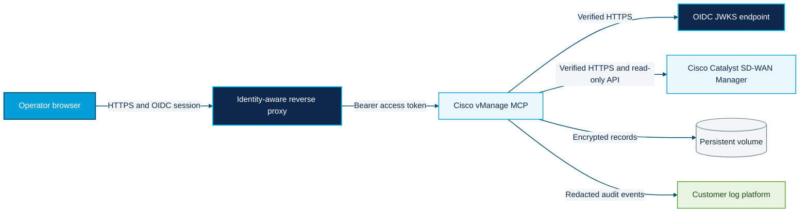

# Enterprise Deployment

This guide describes the supported production topology for the browser Operations Canvas. The current product scope is Cisco Catalyst SD-WAN managed by vManage. Support for other Cisco product families is roadmap work and must not be inferred from the shared Cisco branding.

## Deployment boundary

Deploy one application instance per customer tenant and vManage environment. The application is not a multi-tenant SaaS service: investigation, snapshot, workflow, and audit storage is isolated by deployment. OIDC identities must carry the configured tenant claim, and a token for any other tenant is rejected.



The reverse proxy performs the interactive OIDC login. The application independently validates every forwarded bearer token's signature, issuer, audience, lifetime, tenant, and application role. The application does not create an authentication cookie and does not trust identity headers.

## Guided Setup workspace

The browser includes a Setup workspace as the first navigation item. In local mode it provides a junior-friendly sequence:

1. Confirm the local-owner deployment boundary and private configuration path.
2. Enter a read-only vManage hostname, port, username, password, TLS policy, and optional CA bundle path.
3. Test authentication and inspect the complete read-only qualification report before Save becomes available.
4. Save atomically to the owner-only configuration file, reconnect without restarting, and review optional connector requirements.

When an existing connection is active, **Qualify current connection** generates the same report without requesting stored credentials. The report can be downloaded as sanitized JSON and contains aggregate device families and versions plus per-capability endpoint status, latency, row count, and failure reason. It excludes credentials and device identities.

In enterprise mode the same screen is diagnostic-only. It shows identity, tenant, connection, connector, and AI status, but connection fields cannot be changed. Enterprise secrets continue to be managed by the approved deployment secret system.

See the [Guided Setup Guide](SETUP_GUIDE.md) for the Cisco-colored onboarding flow, field descriptions, report contents, and troubleshooting table.

## Required proxy behavior

The identity-aware proxy must:

1. Terminate TLS with a customer-approved certificate.
2. Authenticate the user with the approved OIDC provider.
3. Remove inbound `Authorization`, `Forwarded`, and `X-Forwarded-*` headers before setting trusted replacements.
4. Forward a signed JWT access token as `Authorization: Bearer <token>` on every application request.
5. Preserve the configured public `Host` and set `X-Forwarded-Proto: https`.
6. Reach the application from an IP or CIDR listed in `VMANAGE_WEB_TRUSTED_PROXY_IPS`.
7. Keep the application service private; users must not be able to bypass the proxy.

Use the packaged `vmanage-web` entry point. It disables Uvicorn's generic proxy-header rewriting so the application can validate the actual socket peer before accepting `X-Forwarded-Proto`. If an external ASGI process manager is required, disable its proxy-header rewriting and preserve the direct peer address; this topology requires a separate acceptance test.

Bearer authentication is deliberately non-cookie-based. The Origin and Fetch Metadata checks are defense in depth for browser mutations; introducing application cookies requires a separate CSRF-token design and security review.

## OIDC claims

The default claim contract is:

| Purpose | Default claim/value |
|---|---|
| Stable subject | `sub` |
| Customer tenant | `tid` |
| Display name | `name` |
| Application roles | `roles` |
| Owner role | `vmanage-owner` |
| Operator role | `vmanage-operator` |
| Viewer role | `vmanage-viewer` |

Claim names and role values are configurable. Owner takes precedence over operator, and operator takes precedence over viewer. Tokens without a configured role, with the wrong tenant, or signed using an unapproved asymmetric algorithm are rejected.

The application role matrix is deliberately conservative:

| Role | Effective access |
|---|---|
| Viewer | Authenticated `GET`/`HEAD` access only. Browser chat and all state-changing API calls are denied because they use `POST`, even when upstream network access would remain read-only. |
| Operator | Viewer access plus investigations, comments, evidence collection, snapshots, workflow previews, plan creation, and post-change verification. |
| Owner | Operator access plus ownership changes, agent registration, exact-hash plan approval, and plan cancellation. |

No role can execute a network change. The Apply endpoint remains disabled for owners as well.

When the provider exposes an access-token discriminator, configure both `VMANAGE_WEB_OIDC_TOKEN_USE_CLAIM` and `VMANAGE_WEB_OIDC_REQUIRED_TOKEN_USE`. For example, providers that emit `token_use=access` should require that exact value so an ID token cannot be substituted for an access token.

## Required configuration

The following values are non-secret deployment configuration:

```dotenv
VMANAGE_WEB_AUTH_MODE=oidc
VMANAGE_WEB_HOST=0.0.0.0
VMANAGE_WEB_PORT=8765
VMANAGE_WEB_PUBLIC_URL=https://operations.example.com
VMANAGE_WEB_ALLOWED_HOSTS=operations.example.com
VMANAGE_WEB_TRUSTED_PROXY_IPS=10.42.0.0/16
VMANAGE_WEB_OIDC_ISSUER=https://identity.example.com/tenant
VMANAGE_WEB_OIDC_AUDIENCE=cisco-vmanage-mcp
VMANAGE_WEB_OIDC_JWKS_URL=https://identity.example.com/tenant/discovery/keys
VMANAGE_WEB_OIDC_JWKS_RETRY_SECONDS=30
VMANAGE_WEB_TENANT_ID=customer-tenant-id
VMANAGE_WEB_OIDC_OWNER_ROLES=vmanage-owner
VMANAGE_WEB_OIDC_OPERATOR_ROLES=vmanage-operator
VMANAGE_WEB_OIDC_VIEWER_ROLES=vmanage-viewer
VMANAGE_WEB_STATE_DIR=/var/lib/cisco-vmanage-mcp
VMANAGE_VERIFY_SSL=true
AUDIT_STDERR=true
```

The following values are secrets and must come from the customer's secret manager, External Secrets Operator, sealed-secret workflow, or equivalent control:

- `VMANAGE_USERNAME`
- `VMANAGE_PASSWORD`
- Optional connector and AI-provider tokens

Do not commit Kubernetes Secret manifests or pass secret literals on a shell command line. Mount private CA files read-only and set `VMANAGE_CA_BUNDLE` for vManage or `VMANAGE_WEB_OIDC_CA_BUNDLE` for the identity provider as needed.

## Container image

The repository [Dockerfile](../Dockerfile) creates a multi-stage image that:

- installs only the built wheel and runtime dependencies;
- runs as UID/GID `10001`;
- uses a read-only-compatible root filesystem;
- stores encrypted mutable state under `/var/lib/cisco-vmanage-mcp`;
- starts through `vmanage-web`, which validates the deployment configuration;
- exposes an unauthenticated liveness endpoint only at `/health/live`.

Build and inspect it in the customer's approved image pipeline:

```bash
docker build --pull --tag registry.example.com/cisco-vmanage-mcp:2.2.0 .
docker run --rm --entrypoint python registry.example.com/cisco-vmanage-mcp:2.2.0 \
  -c "import cisco_vmanage_mcp; print(cisco_vmanage_mcp.__version__)"
```

Scan the resulting image and generate an SBOM using the organization's approved tooling before promotion.

## Kubernetes base

The base under [deploy/kubernetes/base](../deploy/kubernetes/base) provides:

- one replica with `Recreate` rollout semantics for the local SQLite stores;
- a non-root, capability-free, read-only container security context;
- a `ReadWriteOnce` persistent volume for encrypted state;
- bounded CPU and memory defaults;
- liveness and readiness probes;
- a private `ClusterIP` service;
- no service-account token mount.

Create a customer overlay rather than editing the base. At minimum, replace the image, public URL, allowed host, proxy CIDR, issuer, audience, JWKS URL, tenant ID, storage class, and resource sizing. Create the referenced `cisco-vmanage-mcp-secrets` through the approved secret workflow.

```bash
kubectl kustomize deploy/kubernetes/base
kubectl apply -k deploy/kubernetes/overlays/customer
```

The example network policy is intentionally not part of the base because vManage, DNS, identity-provider, connector, and ingress CIDRs differ by customer. Copy it into the overlay, replace the documentation CIDR, and allow only the required destinations.

## Operations

- `/health/live` reports process liveness and does not expose version or identity details.
- `/health/ready` reports whether application startup completed. Upstream vManage errors remain visible through normal API responses and monitoring.
- Every response carries `X-Request-ID`; a syntactically safe incoming value is preserved for trace correlation.
- API and health responses are non-cacheable.
- Enterprise HTTPS responses include HSTS. The edge proxy must set HSTS as well.
- Audit events should be sent to stderr and collected by the customer logging platform.
- Back up the persistent volume and encryption key files together. Losing a per-store key makes that store unrecoverable.
- Keep replicas at one while SQLite is the persistence backend. High availability requires the external persistence milestone in the roadmap.

## Production acceptance

Before exposing the service to users, verify all of the following in the target environment:

1. Direct access to the application service is blocked.
2. Missing, expired, wrong-audience, wrong-tenant, and wrong-role tokens fail closed.
3. The immediate proxy peer matches `VMANAGE_WEB_TRUSTED_PROXY_IPS` and untrusted forwarded headers are ignored.
4. vManage and OIDC TLS chains validate without disabling verification.
5. Owner, operator, and viewer roles pass the agreed authorization matrix.
6. The customer explicitly decides whether an access-token discriminator is required and configures `VMANAGE_WEB_OIDC_TOKEN_USE_CLAIM` plus `VMANAGE_WEB_OIDC_REQUIRED_TOKEN_USE` when the provider supports one.
7. Persistent-state backup and restore succeeds with file permissions preserved.
8. Audit events reach the approved immutable destination without response content or secrets.
9. Load, soak, disaster recovery, privacy, accessibility, and penetration-test gates are signed off.
10. The environment qualification matrix confirms the customer's exact Catalyst SD-WAN release and enabled API capabilities.

Live network mutation remains unavailable in this deployment. The Apply endpoint always returns HTTP 403.