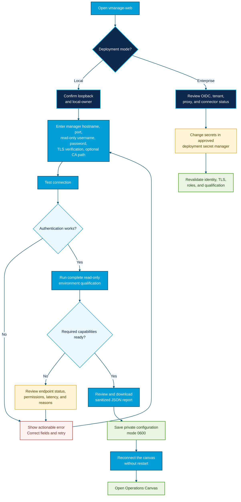

# Guided Setup Guide

This guide takes a new operator from installation to a qualified Cisco Catalyst SD-WAN connection. It is intentionally written for a junior engineer while preserving the full technical evidence produced by the application.

## What Setup Does

The Setup workspace separates onboarding into four visible stages:

1. **Deployment** confirms whether settings are local or controlled by an enterprise platform.
2. **Connection** validates a dedicated read-only vManage account and TLS policy.
3. **Qualification** checks every supported read-only endpoint and retains the detailed result.
4. **Integrations** identifies optional connectors and the exact environment keys they require.

Setup never enables network writes. The Apply endpoint remains disabled after setup completes.

## Setup Flow



The diagram uses Cisco Blue (`#049FD9`) for operator actions, Cisco Navy
(`#0D274D`) for deployment boundaries, Cisco Cyan (`#00BCEB`) for boundary
accents, green for successful completion, amber for attention, and red only for
corrective action.

## Before You Start

Have the following information ready:

- The vManage hostname or IPv4 address. Do not include `https://` or a path.
- The HTTPS port, normally `443`.
- A dedicated vManage service account with read access only.
- The password for that account.
- The path to a private CA bundle when the customer does not use a publicly trusted certificate authority.

For production, do not disable TLS verification. Install or mount the correct CA bundle instead.

## Local Setup

Start the browser:

```bash
vmanage-web
```

Open `http://127.0.0.1:8765/#setup`. If the connection is missing or invalid, the application opens this screen automatically.

### 1. Deployment

Confirm these values:

- **Configuration mode:** `Local guided setup`
- **Signed-in role:** `owner`
- **Tenant:** `local`
- **Credential storage:** normally `~/.vmanage-mcp/vmanage.env`

The setup file and its parent directory are restricted to the current operating-system user.

### 2. Cisco SD-WAN Manager Connection

Complete each field:

| Field | What to enter | Example |
|---|---|---|
| Manager hostname | DNS name or IPv4 address only | `vmanage.customer.example` |
| HTTPS port | API HTTPS port | `443` |
| Read-only username | Dedicated service account | `mcp-readonly` |
| Password | Service-account password | Enter in the password field |
| Verify TLS certificate | Keep enabled | Checked |
| Private CA bundle path | Server-side path, if needed | `/etc/ssl/customer-vmanage-ca.pem` |

Select **Test connection**. Save remains disabled until the entered values pass their own test. Qualifying an already connected environment does not authorize different form values for saving.

### 3. Environment Qualification

Qualification reports:

- manager address and readiness;
- aggregate device count, roles, and model families;
- software-version counts;
- every supported read-only API endpoint;
- required or optional status;
- availability, permission, or unsupported state;
- returned row count;
- response duration;
- sanitized failure reason.

Select **Download JSON report** to retain the same details for the customer onboarding record. The report excludes usernames, passwords, tokens, hostnames, system IPs, configurations, and response bodies.

### 4. Save and Connect

When required capabilities are ready, select **Save and connect**. The application:

1. tests the connection again on the server;
2. atomically writes the owner-private configuration file;
3. replaces the active client without restarting the process;
4. clears the password field;
5. refreshes the Operations Canvas.

Select **Open Operations Canvas** when the final status reads `Core setup is complete`.

## Existing Connections

Use **Qualify current connection** to rerun all capability checks without entering the stored username or password. This is useful after:

- a vManage upgrade;
- a service-account permission change;
- a certificate or CA update;
- an API outage;
- onboarding a new device family.

## MCP Client Registration

The browser configures the server connection. To register the MCP server with supported desktop clients, run the displayed command on each operator workstation:

```bash
vmanage-mcp-install
```

The installer detects supported Claude Desktop, Claude Code, and Cursor configurations. It stores only the private configuration-file path in client configuration; it does not place credentials in MCP JSON.

## Optional Integrations

Optional services never block core SD-WAN operation. Setup lists their current state and required environment keys:

| Integration | Required keys |
|---|---|
| Cisco ThousandEyes | `THOUSANDEYES_MCP_URL`, `THOUSANDEYES_MCP_TOKEN` |
| Splunk evidence | `SPLUNK_EVIDENCE_URL`, `SPLUNK_EVIDENCE_TOKEN` |
| Cisco AppDynamics | `APPDYNAMICS_EVIDENCE_URL`, `APPDYNAMICS_EVIDENCE_TOKEN` |
| Browser AI | `BROWSER_AI_PROVIDER`, `BROWSER_AI_MODEL`, plus the selected provider credential |

Configure these through the approved environment or secret manager, then restart the deployment. The Setup screen shows their resulting state.

## Enterprise Setup

In OIDC enterprise mode, Setup is deliberately status-only. Browser users cannot replace controller or identity secrets. Platform engineers configure them through the deployment configuration and approved secret manager, then operators use Setup to verify:

- OIDC mode, tenant, and current application role;
- manager connection state;
- optional connector state;
- browser AI state;
- current environment qualification.

See [Enterprise Deployment](ENTERPRISE_DEPLOYMENT.md) for proxy, OIDC, Kubernetes, CA, backup, and production-acceptance requirements.

## Troubleshooting

| Message or state | What to check |
|---|---|
| Credentials are not configured | Enter a read-only username and password, then test. |
| Authentication failed | Confirm account status, password, and vManage authentication policy. |
| TLS or connection failure | Confirm DNS, port, firewall path, certificate chain, and CA bundle path. |
| Inventory forbidden | Grant the service account read access to `/dataservice/device`. |
| Optional capability forbidden | Review the exact endpoint in the table; core readiness may still pass. |
| Endpoint unsupported | Record the vManage version and retain the qualification report. |
| Save remains disabled | Retest after the most recent field change and ensure required checks are ready. |
| Setup is not editable | The deployment is enterprise-managed or the current user is not an owner. |

Do not solve certificate errors by disabling verification in production. Do not grant write privileges to make a read-only qualification pass.
